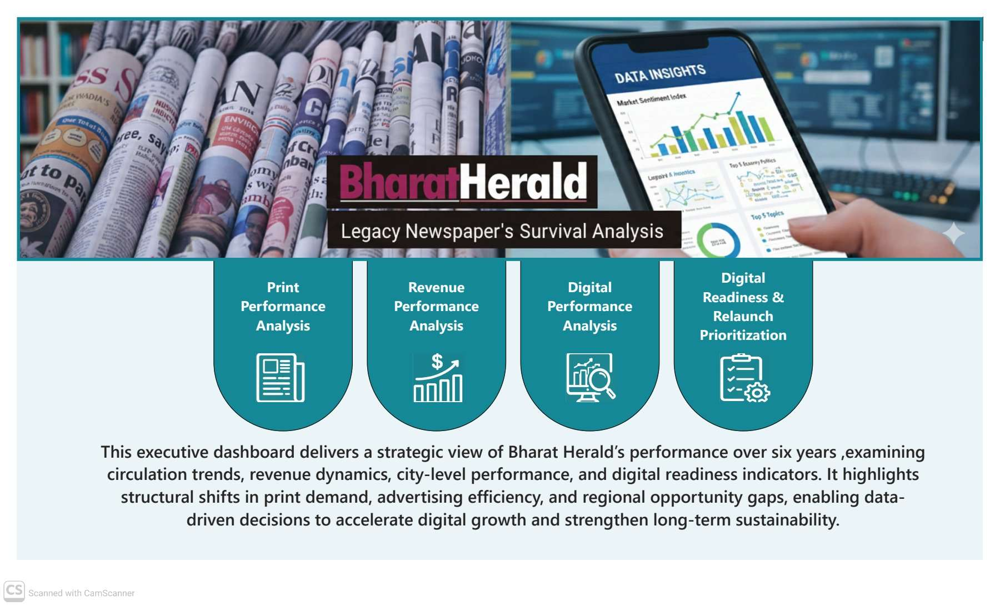
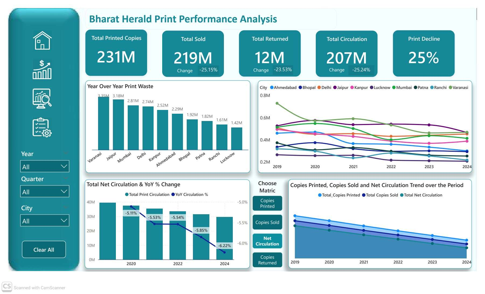
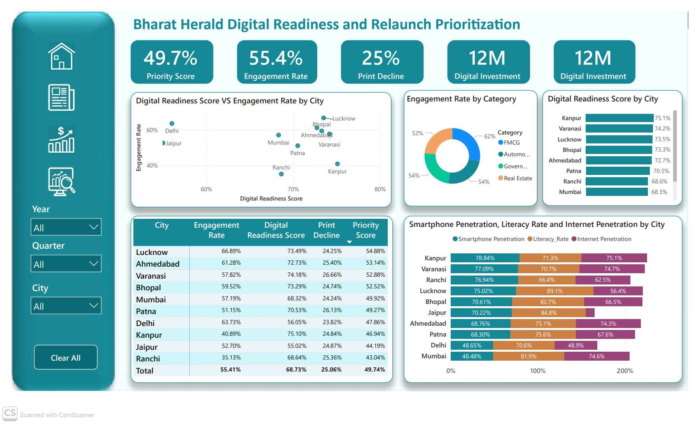

# **# Bharat Herald Media & Survival Analysis (Unguided Project)** 
## Author:          Aftab Ahmad
## Date:            26 February, 2026
## Contact:         aftabajk@gmail.com

## **``Project Introduction``**:
This project is a data-driven turnaround strategy for Bharat Herald, a legacy newspaper established in 1956. By analyzing operational data from 2019 to 2024, I have developed a roadmap to transition the organization from a declining print model to a high-efficiency digital future. This project is part of the Codebasics Resume Challenge.

## **``Scenario``**:
For seven decades, Bharat Herald was a dominant voice in regional journalism. However, the post-2019 landscape brought an existential crisis: a 25.06% overall print decline and an alarming 3.35M cumulative print waste in under-monetized cities like Varanasi. A failed 2021 digital pilot left the company struggling to find its footing in a mobile-first world.

### **Stakeholders**:
The stakeholder for this comprehensive data assessment report is **Tony Sharma** Executive Director of Bharat Herald.
  
## **``Business Problem``**:
The core challenge is a "Death Spiral" of declining circulation and inefficient ad spending. The objective is to identify how Bharat Herald can cut operational waste, reclaim advertiser trust in key sectors like Real Estate, and successfully relaunch its digital platforms in high-readiness markets

## **``Tools Used``**:
- **Power BI**:	    Dashboard creation and storytelling
- **Power Query**:	Data cleaning, shaping, and transformation
- **DAX**:		    Calculated measures and KPIs within Power BI

## **``Data Source``**:
The dataset has been sourced from the Codebasics website. Data for this assement analysis is open access to the public for data analysis and insight generation, making it a valuable educational resource. You can access the data [here](https://codebasics.io/challenges/codebasics-resume-project-challenge/21). 

## **``About the Datasets``**:
- ``dim_City``: Lookup table for all cities in Bharat Herald’s operational scope.
- ``dim_ad_category``: Normalizes inconsistent ad category entries from fact_ad_revenue.
- ``fact_ad_revenue``: Tracks quarterly ad revenues by city and category.
- ``fact_city_readiness``: Provides dynamic, time-based readiness scores for each city using three factors-literacy rate, smartphone penetration, and internet penetration.
- ``fact_digital_pilot``: Details Bharat Herald’s short-lived digital pilot during 2021.
- ``fact_Print_sales`` : Captures monthly print performance of Bharat Herald across cities.\
Data dictionary for each data segment can be accessed [here](https://github.com/Aftab-Ahmadajk/Bharat-Herald-Media-Survival-Analysis-Project/blob/main/Datasets/metadata.txt)

## **``Deliverables``**:
-	**Executive Summary**: A strategic roadmap with focused insights and prescriptive actions.
-	**Power BI Report**: Interactive dashboards visualizing the print-to-digital transition.
-	**Video Presentation**: A professional walkthrough of the analysis and findings.

## **``Data Model``**:
An integrated star-schema data model that unifies print, revenue, digital engagement, and city-level metrics through shared dimensions enabling consistent, cross-functional, and time-based performance analysis.

## **``Key Insights``**
I conducted a comprehensive analysis using Powerbi to address the primary and secondary questions posed by the stakeholders. During this process, I identified several key insights that were instrumental in answering these critical questions.
- **``Accelerating Print Contraction``**: Structural decay is evident as Net Circulation (-6.22%) is falling faster than production can be reduced, making the digital transition an immediate necessity.
- **``The Volume-Profit Paradox``**: High-volume hubs like Varanasi and Jaipur are flagged as "Low Performers" due to poor margins, while smaller markets like Patna and Lucknow drive sustainability with higher net profits.
- **``Operational "Leaks"``**: Varanasi (3.35M) and Jaipur (3.18M) exhibit the largest cumulative waste gaps, signaling that the "cost of reach" in legacy cities is becoming unsustainable.
- **``Revenue Leadership Shift``**: Government ad dominance has plummeted, replaced by Real Estate as the top category at ₹114M by 2024, while FMCG shows strong recovery resilience.
- **``Monetization Efficiency``**: Lucknow leads with a superior ₹18.14 ad revenue per copy, significantly outperforming legacy markets like Varanasi (₹7.10) in per-copy profitability.
- **``The Engagement Gap``**: Kanpur possesses the highest digital readiness (75.10%) but the lowest pilot engagement (~40%), indicating failures due to UX friction rather than a lack of technology.
- **``Digital Adoption``**: The Mobile App Beta outperformed all other channels, achieving the highest active access with 209K users and the lowest drop-off rate of 38.17%

## **``Recommendations``**
-	**``Pivot to "Value-First" Monetization``**: Replicate high-margin models from Patna and Lucknow across all hubs to prioritize yield per reader over raw circulation volume.
-	**``Halt Operational Leaks``**: Implement a Demand-Sensing Model and downscale print runs in Varanasi and Jaipur to stop the financial hemorrhage caused by 6.5M+ in cumulative waste.
-	**``Targeted Digital Relaunch``**: Launch a premium mobile app in Lucknow and WhatsApp-based news in Ahmedabad to capitalize on their peak engagement rates.
-	**``Bridge the Engagement Gap``**: Execute a total UX overhaul in Kanpur and Varanasi to convert high digital readiness (74%+) into active usage through low-friction delivery.
-	**``Modernize Ad Sales``**: Secure the ₹886.32M Commercial Brand segment by bundling resilient Real Estate and FMCG sectors into integrated "Print + Digital" packages.
-	**``Regional Credibility``**: Empower local journalists and influencers in Phase 1 cities to lead "Expert Bulletins," transforming legacy authority into digital thought leadership.
-	**``Mobile-First Format``**: Replace heavy e-papers with lightweight WhatsApp Bulletins and a "Lite" app to fix the 75% bounce rate in cities like Varanasi.

## **``Dashboard Insights``**:

**Print Performance Analysis**;

**Revenue Performance Analysis**;

**Digital Performance Analysis**;

**Digital Readiness and Relaunch Prioritization**;

## **``Conclusion``**:
Bharat Herald’s survival depends on evolving from a "Mass Reach" organization to a "High-Value Engagement" entity. By replicating the high-margin Lucknow Model and removing digital friction in high-readiness cities, Bharat Herald can successfully transition its 70-year legacy into the modern mobile era.

Thank you for taking the time to read my analysis report on Bharat Herald a legacy newspaer.

I would greatly appreciate your feedback and suggestions regarding this analysis report. Your input is invaluable in helping me refine and improve my work. Please feel free to share your thoughts by emailing me at **aftabajk@gmail.com** or connecting with me on [LinkedIn](https://www.linkedin.com/in/aftab-ahmad-data-analyst/)

